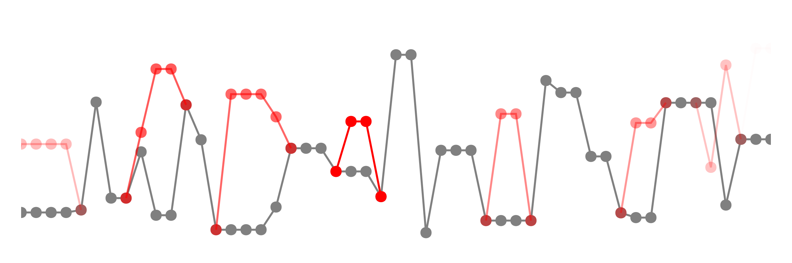

[](https://arxiv.org/abs/2306.07961)
[](https://arxiv.org/abs/2406.14451)

# Differentiable Metropolis-Hastings 

This repository contains the code to reproduce the experiments related to our papers on Differentiable Metropolis-Hastings:
 * [Gradient Estimation via Differentiable Metropolis-Hastings](https://arxiv.org/abs/2406.14451).
 * [Differentiating Metropolis-Hastings to Optimize Intractable Densities](https://arxiv.org/abs/2306.07961) (code under [ICML tag](https://github.com/gaurav-arya/differentiable_mh/tree/icml)).

## Citations

```
@misc{arya2024gradient,
    title={Gradient Estimation via Differentiable Metropolis-Hastings},
    author={Gaurav Arya and Moritz Schauer and Ruben Seyer},
    year={2024},
    eprint={2406.14451},
    archivePrefix={arXiv}
}

@inproceedings{arya2023differentiating,
    title={Differentiating Metropolis-Hastings to Optimize Intractable Densities},
    author={Gaurav Arya and Ruben Seyer and Frank Sch{\"a}fer and Kartik Chandra and Alexander K. Lew and Mathieu Huot and Vikash Mansinghka and Jonathan Ragan-Kelley and Christopher Vincent Rackauckas and Moritz Schauer},
    booktitle={ICML 2023 Workshop on Differentiable Almost Everything: Differentiable Relaxations, Algorithms, Operators, and Simulators},
    year={2023},
    url={https://openreview.net/forum?id=2jag4Yatsz}
}
```
