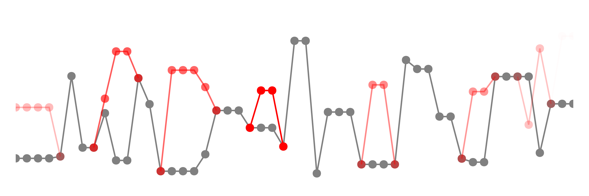

# Differentiable Metropolis-Hastings 

This repository contains the code to reproduce the experiments in our work "Differentiating Metropolis-Hastings to Optimize Intractable Densities".

## Abstract

When performing inference on probabilistic models, target densities often become intractable, necessitating the use of Monte Carlo samplers. We develop a methodology for unbiased differentiation of the Metropolis-Hastings sampler, allowing us to differentiate through probabilistic inference. By fusing recent advances in stochastic differentiation with Markov chain coupling schemes, the procedure can be made unbiased, low-variance, and automatic. This allows us to apply gradient-based optimization to objectives expressed as expectations over intractable target densities. We demonstrate our approach by finding an ambiguous observation in a Gaussian mixture model and by maximizing the specific heat in an Ising model.

## Citation

To be added

## Reproducing plots

To reproduce the plots in the `plots` folder:

* Enter the `scripts` folder.
* Run `julia _setup_env.jl` to setup your environment.
* Run `julia {script name}.jl` for each of the four scripts to produce the plots.