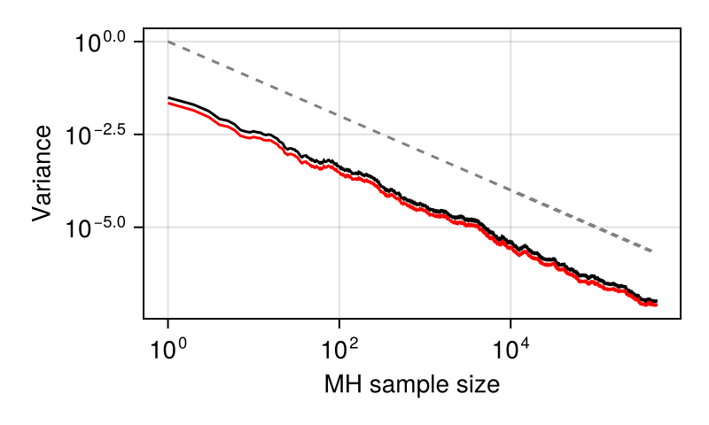
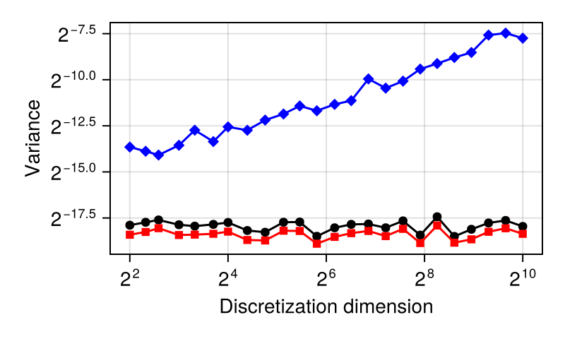

# Sensitivity of a conditional SDE

````julia

using DataFrames
using DifferentiableMH
using Distributions
using MCMCChains
using ProgressMeter
using StochasticAD
using Statistics
using CairoMakie
import ForwardDiff
import Random

Random.seed!(20250805);
Random.seed!(StochasticAD.RNG, 20250805 + 1);

# Set up StochasticAD to use the stochastic derivatives in the paper
backend = StrategyWrapperFIsBackend(PrunedFIsBackend(Val(:wins)), StochasticAD.StraightThroughStrategy())  # aka uniformly pruning MVD
alg = StochasticAD.ForwardAlgorithm(backend)
;
````

Set up the model and the proposal.

````julia
function girsanov_loglik(x, dt, μ, σ)
    # x: vector of time series values of the path
    # dt: time step size
    # μ: drift function
    # σ: constant diffusion coefficient

    n = length(x)
    loglik = 0.0*σ

    for i in 2:n
        dx = x[i] - x[i-1]
        drift = μ(x[i-1])
        loglik += (drift * dx - 0.5 * drift^2 * dt) / σ^2
    end

    return loglik
end
````

````
girsanov_loglik (generic function with 1 method)
````

In an unconditional setting we use standard Brownian motions, in a conditional setting we use Brownian bridges.

````julia
struct BrownianProposal{T,S}
    x0::T
    σ::S
    dt::Float64
    M::Int
end
function Base.rand(rng::Random.AbstractRNG, prop::BrownianProposal)
    x = zeros(prop.M+1)
    x[1] = 0.0
    for i in 2:prop.M+1
        x[i] = x[i-1] + sqrt(prop.dt) * randn(rng)
    end
    return prop.x0 .+ prop.σ * x
end
function Distributions.logpdf(prop::BrownianProposal, x)
    0.0 # uniform on path space, so it cancels
end
function lebesguelogpdf(prop::BrownianProposal, x)
    sum(z -> logpdf(Normal(0.0, prop.σ*√(prop.dt)), z), diff(x))
end

struct BrownianBridgeProposal{T,R,S}
    x0::T
    xT::R
    σ::S
    dt::Float64
    M::Int
end
function Base.rand(rng::Random.AbstractRNG, prop::BrownianBridgeProposal)
    x = zeros(typeof(prop.x0 + prop.σ * prop.xT), prop.M+1)
    x[1] = 0.0
    for i in 2:prop.M+1
        x[i] = x[i-1] + sqrt(prop.dt) * randn(rng)
    end
    for i in 1:prop.M+1
        x[i] = prop.x0 + prop.σ * x[i] + (prop.xT - prop.x0 - prop.σ * x[end]) * (i-1) / prop.M
    end
    return x
end
function Distributions.logpdf(prop::BrownianBridgeProposal, x)
    0.0 # uniform on path space, so it cancels
end
function lebesguelogpdf(prop::BrownianBridgeProposal, x)
    # Transform to a standard bridge https://math.stackexchange.com/questions/3604336/computing-the-finite-dimensional-marginal-distributions-of-brownian-bridge
    sum(z -> logpdf(Normal(prop.dt*(x[end] - x[begin]), prop.σ*√(prop.dt)), z), diff(x))
end

x0 = 0.0
xT = 1.0
σ = 1.2
μ_target(x) = 0.7*(0.5 - x)

# Sampler parameters
T = 1.0             # final time
M = 100             # number of time steps
n_samples = 500_000
f(path) = max(mean(path) - 0.5, zero(path[end])) # "Asian call option" strike 0.5
##f(path) = tanh(mean(path)^2)  ## bounded

function estimate_conditional_sde(σ; get_samples = Val(false), n_samples = n_samples, M = M, f = f)
    raw_proposal = BrownianBridgeProposal(x0, xT, σ, T/M, M)
    init = rand(raw_proposal)
    proposal = IndependentMHProposal{typeof(init)}(raw_proposal)
    return mh(X -> girsanov_loglik(X, T/M, μ_target, σ), proposal, init;
        iters = n_samples, burn_in = 0, f, f_init=zero(f(init)), proposal_coupling = IndependentMHProposalCoupling(), get_samples)
end;
````

Single trajectory test of the raw sampler, including some diagnostics.
TODO Can we compute the theoretical answer?

````julia
E, samples = estimate_conditional_sde(σ; get_samples = Val(true))
E′ = estimate_conditional_sde(σ + 0.05)
(E′ - E)/0.05
````

````
0.13145705638147098
````

````julia
E_st = estimate_conditional_sde(stochastic_triple(σ; backend))
````

````
StochasticTriple of Float64:
0.13415737399950892 + 0.11177724040126287ε
````

````julia
describe(Chains(f.(samples)))
````

````
Chains MCMC chain (500000×1×1 Array{Float64, 3}):

Iterations        = 1:1:500000
Number of chains  = 1
Samples per chain = 500000
parameters        = param_1

Summary Statistics
  parameters      mean       std      mcse      ess_bulk      ess_tail      rhat   ess_per_sec
      Symbol   Float64   Float64   Float64       Float64       Float64   Float64       Missing

     param_1    0.1334    0.1955    0.0003   478614.3465   470279.0489    1.0000       missing

Quantiles
  parameters      2.5%     25.0%     50.0%     75.0%     97.5%
      Symbol   Float64   Float64   Float64   Float64   Float64

     param_1    0.0000    0.0000    0.0000    0.2261    0.6565

````

Variance as a function of sample size; empirically confirms the geometric convergence of both estimate and derivative estimate

````julia
smooth_triple_map = Base.Fix1(StochasticAD.structural_map, StochasticAD.smooth_triple)
Random.seed!(20250805);
Random.seed!(StochasticAD.RNG, 20250805 + 1);
replicates = 50

raw_primals = Array{Float64}(undef, replicates, n_samples)
raw_duals = Array{Float64}(undef, replicates, n_samples)
@showprogress for j in 1:replicates
    ret, samples = estimate_conditional_sde(stochastic_triple(σ; backend); get_samples=Val(true))
    raw_estimates = cumsum(smooth_triple_map.(f.(samples))) ./ (1:n_samples)
    raw_primals[j,:] = StochasticAD.value.(raw_estimates)
    raw_duals[j,:] = StochasticAD.delta.(raw_estimates)
end
asymptotics_samples = let
    primal_mean = mean(raw_primals, dims=1)
    dual_mean = mean(raw_duals, dims=1)
    DataFrame(n = 1:n_samples, primal_mean = vec(primal_mean), primal_std = vec(std(raw_primals, dims=1; mean=primal_mean)), dual_mean = vec(dual_mean), dual_std = vec(std(raw_duals, dims=1; mean=dual_mean)));
end

fig_samples = Figure(size=(400,240))
ax = Axis(fig_samples[1, 1], xlabel = "MH sample size", ylabel = "Variance", xscale=log10, yscale=log10)
lines!(ax, 1:n_samples, 1 ./ (1:n_samples); color = :gray, linestyle=:dash, label="1/N")
lines!(ax, 1:n_samples, asymptotics_samples[:,"primal_std"].^2; color = :black, label="Primal")
##band!(ax, 1:n_samples, (1 + sqrt(2/(replicates - 1))) * asymptotics_samples[:,"primal_std"].^2, (1 - sqrt(2/(replicates - 1))) * asymptotics_samples[:,"primal_std"].^2; color = (:black, 0.2))
lines!(ax, 1:n_samples, asymptotics_samples[:,"dual_std"].^2; color = :red, label="DMH")
##band!(ax, 1:n_samples, (1 + sqrt(2/(replicates - 1))) * asymptotics_samples[:,"dual_std"].^2, (1 - sqrt(2/(replicates - 1))) * asymptotics_samples[:,"dual_std"].^2; color = (:red, 0.2))
##axislegend(ax, orientation = :horizontal, framevisible=false)
fig_samples
````


Variance as a function of discretization dimensionality, compared against the score method.

````julia
Random.seed!(20250805);
Random.seed!(StochasticAD.RNG, 20250805 + 1);
replicates = 50
Ms = floor.(Int, 2 .^ range(2,10;length=24))

# Score method requires adding the lebesgue likelihood
function f_withscore(path; σ = σ, M = M, f = f)
    primal = f(path)
    path_primal = StochasticAD.value.(path)
    bridge_shift = T/M*(path_primal[end] - path_primal[begin]) # for bridge otherwise just zero
    score = girsanov_loglik(path_primal, T/M, μ_target, σ) + sum(z -> logpdf(Normal(bridge_shift, σ*√(T/M)), z), diff(path_primal))
    return [primal; StochasticAD.delta(score); StochasticAD.value(primal)*StochasticAD.delta(score)]
end

asymptotics_dimension = DataFrame(M = Int[], primal_mean = Float64[], primal_std = Float64[], dual_mean = Float64[], dual_std = Float64[], scored_mean = Float64[], scored_std = Float64[]);
@showprogress for (i, M) in enumerate(Ms)
    primals = Vector{Float64}(undef, replicates)
    duals = Vector{Float64}(undef, replicates)
    scored = Vector{Float64}(undef, replicates)
    for j in 1:replicates
        σ_st = stochastic_triple(σ; backend)
        ret = estimate_conditional_sde(σ_st; M, n_samples=10_000, f = path -> f_withscore(path; σ = σ_st, M = M))
        primals[j] = StochasticAD.value(ret[1])
        duals[j] = StochasticAD.delta(ret[1])
        scored[j] = StochasticAD.value(ret[3]) - primals[j] * StochasticAD.value(ret[2])
    end
    primal_mean = mean(primals); primal_std = std(primals; mean=primal_mean)
    dual_mean = mean(duals); dual_std = std(duals; mean=dual_mean)
    scored_mean = mean(scored); scored_std = std(scored; mean=scored_mean)
    push!(
        asymptotics_dimension,
        (; M, primal_mean, primal_std, dual_mean, dual_std, scored_mean, scored_std)
    )
end

fig_dimension = Figure(size=(400,240))
ax = Axis(fig_dimension[1, 1], xlabel = "Discretization dimension", ylabel = "Variance", xscale=log2, yscale=log2)
scatterlines!(ax, Ms, asymptotics_dimension[:,"primal_std"].^2; color = :black, label="Primal")
##band!(ax, Ms, (1 - sqrt(2/(replicates - 1))) * asymptotics_dimension[:,"primal_std"].^2, (1 + sqrt(2/(replicates - 1))) * asymptotics_dimension[:,"primal_std"].^2; color = (:black, 0.2))
scatterlines!(ax, Ms, asymptotics_dimension[:,"dual_std"].^2; color = :red, marker=:rect, label="DMH")
##band!(ax, Ms, (1 - sqrt(2/(replicates - 1))) * asymptotics_dimension[:,"dual_std"].^2, (1 + sqrt(2/(replicates - 1))) * asymptotics_dimension[:,"dual_std"].^2; color = (:red, 0.2))
scatterlines!(ax, Ms, asymptotics_dimension[:,"scored_std"].^2; color = :blue, marker=:diamond, label="Likelihood Ratio")
##band!(ax, Ms, (1 - sqrt(2/(replicates - 1))) * asymptotics_dimension[:,"scored_std"].^2, (1 + sqrt(2/(replicates - 1))) * asymptotics_dimension[:,"scored_std"].^2; color = (:blue, 0.2))
##axislegend(ax, orientation = :horizontal, framevisible=false)
fig_dimension
````


````julia
# Publication figure
fig = Figure(size=(800,250))
ax = Axis(fig[1,1], xlabel = "MH sample size", ylabel = "Variance", xscale=log10, yscale=log10)
lines!(ax, 1:n_samples, 1 ./ (1:n_samples); color = :gray, linestyle=:dash, label="1/N")
lines!(ax, 1:n_samples, asymptotics_samples[:,"primal_std"].^2; color = :black, label="Primal")
lines!(ax, 1:n_samples, asymptotics_samples[:,"dual_std"].^2; color = :red, label="DMH")
ax = Axis(fig[1,2], xlabel = "Discretization dimension", ylabel = "Variance", xscale=log10, yscale=log10)
scatterlines!(ax, Ms, asymptotics_dimension[:,"primal_std"].^2; color = :black, label="Primal")
scatterlines!(ax, Ms, asymptotics_dimension[:,"dual_std"].^2; color = :red, marker=:rect, label="DMH")
scatterlines!(ax, Ms, asymptotics_dimension[:,"scored_std"].^2; color = :blue, marker=:diamond, label="Likelihood Ratio")#Label(fig[1,1,TopLeft()], "A", font=:bold, padding = (0, 5, 5, 0), halign = :right)
Label(fig[1,1,TopLeft()], "A", font=:bold, halign = :left)
Label(fig[1,2,TopLeft()], "B", font=:bold, halign = :left)
save("../assets/conditional_sde.pdf", fig);
````

---

*This page was generated using [Literate.jl](https://github.com/fredrikekre/Literate.jl).*

