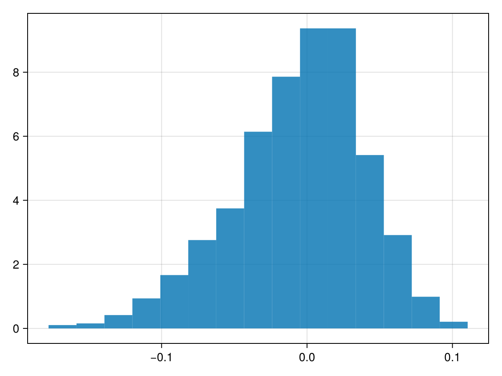
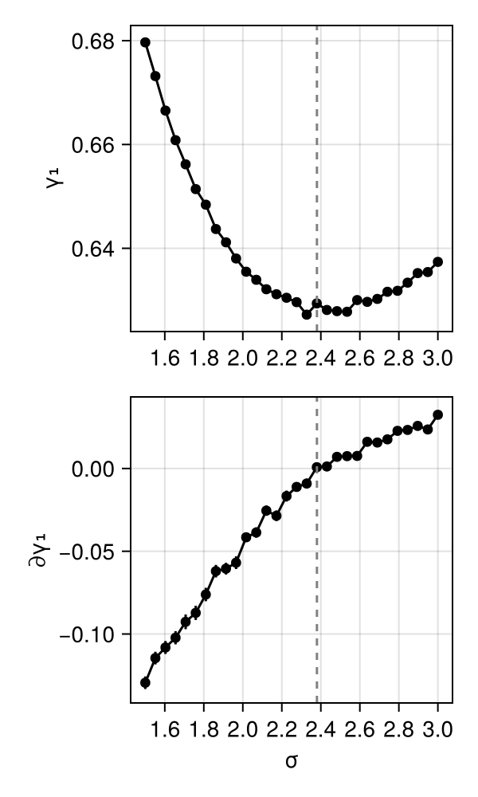
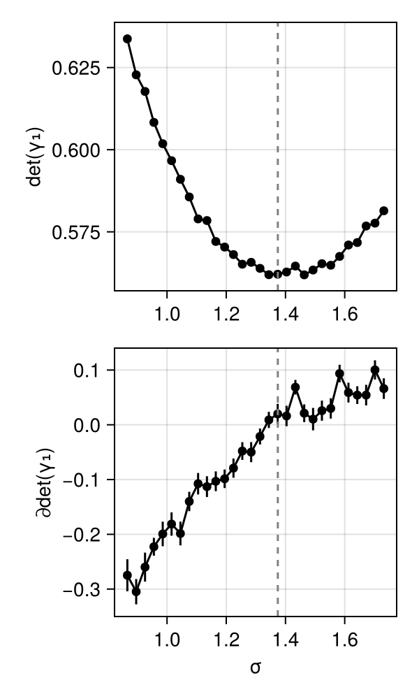
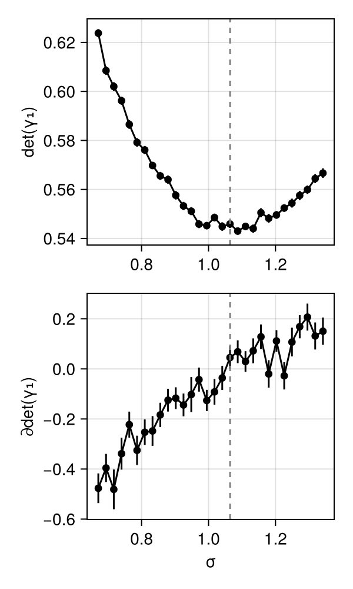
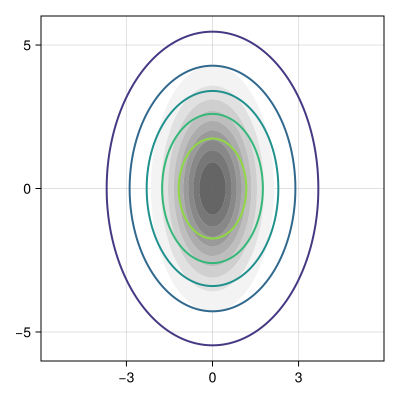
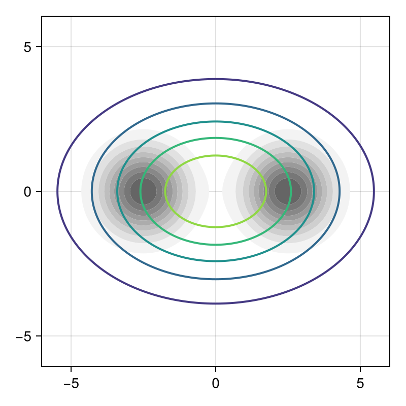
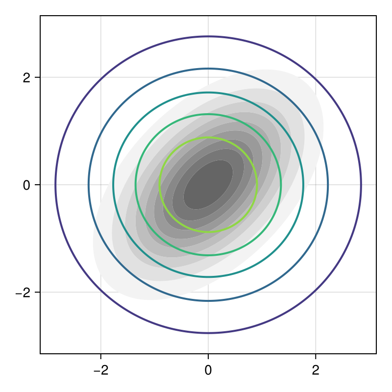
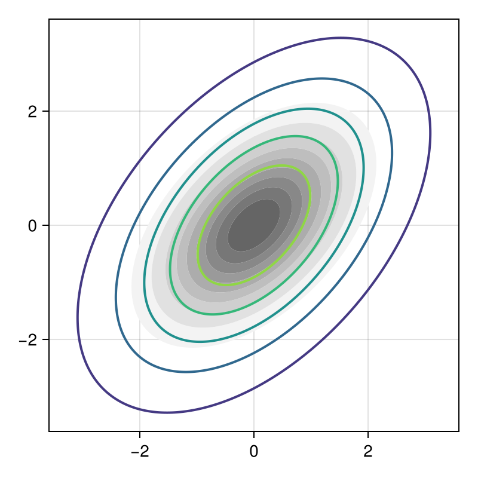
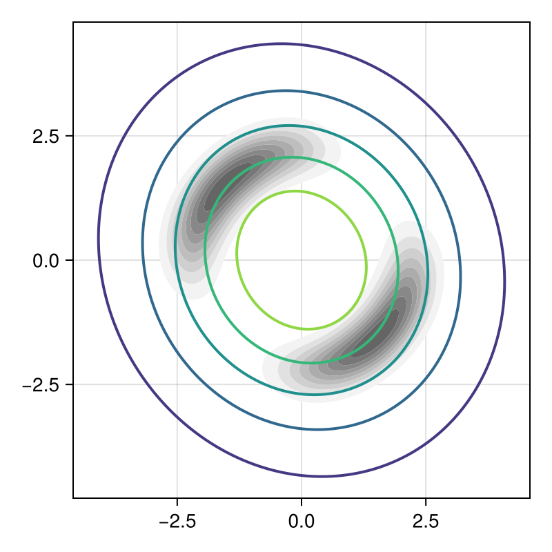
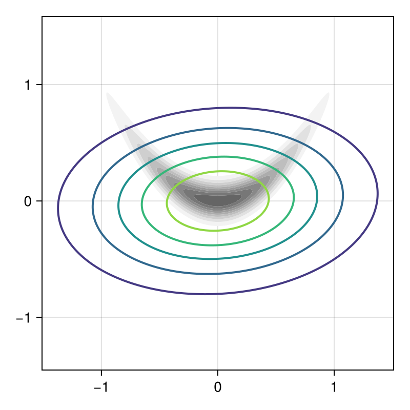

# Gaussian Random Walk Metropolis-Hastings Proposal Tuning

````julia
cd(dirname(@__DIR__))
push!(LOAD_PATH, @__DIR__)
push!(LOAD_PATH, joinpath(dirname(@__DIR__), "Analysis"))

using MHTuningProblem
using Statistics
using Distributions
using StatsBase
using LinearAlgebra
using LogExpFunctions
using CairoMakie
using StochasticAD
using DifferentiableMH
using Optimisers
using ProgressMeter
using Enzyme
using PDMats
using MCMCChains
import Random
import Analysis: take_samples

Random.seed!(20240403);
Random.seed!(StochasticAD.RNG, 20240528);
````

## Introduction
A large part of the performance of MCMC depends on the hyperparameters.
Bad tuning or scaling of the problem can lead to slow convergence or even non-convergence.
In this vignette we consider tuning the step size σ of Gaussian random walk Metropolis-Hastings (RWMH).

The objective we are minimizing is the 1-lag autocovariance, which is intended to be a proxy for mixing speed.
The intuition is that if we are proposing too small steps, the chain is not exploring sufficiently and
hence the state will be highly correlated, while if we are proposing too large steps, the chain will reject most proposals
and hence the states will be highly correlated.

We can skip the centering term (which would require an estimate of the mean as well), since a properly mixing chain in
stationarity should have mean essentially independent of the proposal distribution.

In the paper we argue consistency under some fairly weak moment assumptions on the target distribution.

````julia
problem = make_mh_tuning_problem(100000; target=Normal(0,1))
problem.targets["primal"].X(problem.settings.p, problem.settings)
samples = take_samples(problem, discrete_alg_flags = ["pruning","mvd","uniform"], store_samples = true)
````

````
5×10 DataFrame
 Row │ alg_name               target_name  mean         std         stderr       alg_id               target_id  alg                                target                             samples
     │ String                 String       Float64      Float64     Float64      String               String     Any                                Any                                Any
─────┼───────────────────────────────────────────────────────────────────────────────────────────────────────────────────────────────────────────────────────────────────────────────────────────────────────────────────
   1 │ Primal                 Primal        0.628235    0.00835852  0.000264319  primal               primal     (name = "Primal", flags = Any[])   (X = X, flags = Any[], name = "P…  [0.639747, 0.629159, 0.627688, 0…
   2 │ Pruning MVD            Primal       -0.00497812  0.0154401   0.00048826   pruning_mvd          primal     (backend = StrategyWrapperFIsBac…  (X = X, flags = Any[], name = "P…  [-0.0108673, -0.00659951, -0.035…
   3 │ Pruning                Primal       -0.00488532  0.01574     0.000497743  pruning              primal     (backend = PrunedFIsBackend(), n…  (X = X, flags = Any[], name = "P…  [-0.0133652, -0.0113889, -0.0240…
   4 │ Pruning Uniformly      Primal       -0.00420162  0.0224095   0.000708649  pruning_uniform      primal     (backend = PrunedCustomFIsBacken…  (X = X, flags = Any[], name = "P…  [-0.00359612, -0.00602205, -0.02…
   5 │ Pruning Uniformly MVD  Primal       -0.00553784  0.0448216   0.00141738   pruning_uniform_mvd  primal     (backend = StrategyWrapperFIsBac…  (X = X, flags = Any[], name = "P…  [0.000656905, -0.0166395, -0.095…
````

An example histogram of the estimator:

````julia
pruning_samples = only(samples[samples[!, "alg_id"] .== "pruning_uniform_mvd", :]).samples
fig = Figure()
ax = Axis(fig[1,1])
hist!(ax, pruning_samples; normalization = :pdf)
fig
````


## Example estimates
We will now try a few example targets.
The classical results on asymptotic scaling of RWMH imply that in 1D the optimal
acceptance rate is achieved for a step size σ = 2.38 * √Var(X) for Gaussian targets.
We'll show this value in the plot to compare with the minimum.

````julia
function plot_autocov_estimate_curve(target, θs; N = 250000, x0 = 0.0, θref = nothing, nsims = 100)
    ##' Collect samples for a range of θ values
    problems = map(θ -> make_mh_tuning_problem(N; θ, target, x0), θs);
    all_samples = take_samples.(problems; discrete_alg_flags = "pruning_uniform_mvd", store_samples = false, nsims);

    #=
    ##' Prettier title
    distr_title = repr(target)
    first_newline = findfirst("\n", distr_title)
    if !isnothing(first_newline)
        distr_title = distr_title[1:(first_newline[1]-1)]
    end
    =#

    ##' Plot primal and derivative estimates
    fig = Figure(size=(300,500))
    ax1 = Axis(fig[1, 1], ylabel = length(x0) == 1 ? "γ₁" : "det(γ₁)")
    ax2 = Axis(fig[2, 1], ylabel = length(x0) == 1 ? "∂γ₁" : "∂det(γ₁)", xlabel = "σ")
    linkxaxes!(ax1, ax2)

    primal_samples = map(samples -> only(samples[samples[!, "alg_id"] .== "primal", :]), all_samples)
    deriv_samples = map(samples -> only(samples[samples[!, "alg_id"] .== "pruning_uniform_mvd", :]), all_samples)
    isnothing(θref) && (θref = 2.38 * std(target))

    scatterlines!(ax1, θs, map(r -> r.mean, primal_samples), color = :black)
    errorbars!(ax1, θs, map(r -> r.mean, primal_samples), map(r -> r.stderr, primal_samples), color = :black)
    vlines!(ax1, [θref], color = :gray, linestyle = :dash)
    scatterlines!(ax2, θs, map(r -> r.mean, deriv_samples), color = :black)
    errorbars!(ax2, θs, map(r -> r.mean, deriv_samples), map(r -> r.stderr, deriv_samples), color = :black)
    vlines!(ax2, [θref], color = :gray, linestyle = :dash)
    fig
end;
````

Gaussian target: the conventional wisdom applies

````julia
plot_autocov_estimate_curve(Normal(0,1), LinRange(1.5,3.0,30))
````


How to extend to multidimensional distributions?
With reverse mode, one could try to tune a whole covariance matrix or at least the diagonal,
yielding lots of parameters.
As objective we try the (log) determinant of the cross-covariance matrix (it suffices to differentiate the
so-called scatter matrix by the same argument as in 1D).
This seems resonable, representing the "volume" of the covariance structure.

Previously, we were minimizing the trace.
This worked fine in symmetric problems with a single tuning parameter and recovered theory there, but
seems to lead to weird behaviour for problems with varying scales.

3D Gaussian

````julia
plot_autocov_estimate_curve(MvNormal(zeros(3),I), LinRange(1.5,3.0,30) ./ √3; x0 = zeros(3), θref = 2.38/√3)
````


5D Gaussian

````julia
plot_autocov_estimate_curve(MvNormal(zeros(5),I), LinRange(1.5,3.0,30) ./ √5; x0 = zeros(5), θref = 2.38/√5)
````


## Example optimization
We can use the estimates in a standard optimizer to find the minimum.
Here bypassing the problem interface just to speed things up a bit.

````julia
function opt_autocov(target, θ0, x0; N=200000, opt_iters=400, optimizer=Adam(0.01))
    θ = Float64[θ0]
    proposal_coupling = MaximumReflectionProposalCoupling()
    backend = StrategyWrapperFIsBackend(PrunedFIsBackend(Val(:wins)), StochasticAD.StraightThroughStrategy())  # aka uniformly pruning MVD

    θ_st = stochastic_triple(θ[1]; backend)
    proposal = RandomWalkMHProposal{typeof(x0 * θ_st)}(Normal(0, θ_st))
    out = MHTuningProblem.mh_acf(target, proposal, x0; iters=N, proposal_coupling)
    γ, dγdθ = StochasticAD.value(out.sample_autocorr), StochasticAD.delta(out.sample_autocorr)
    state = Optimisers.setup(optimizer, θ)

    progress = Progress(opt_iters; showspeed=true)
    for _ in 1:opt_iters
        θ_st = stochastic_triple(θ[1]; backend)
        proposal = RandomWalkMHProposal{typeof(x0 * θ_st)}(Normal(0, θ_st))
        out = MHTuningProblem.mh_acf(target, proposal, x0; iters=N, proposal_coupling)
        γ, dγdθ = StochasticAD.value(out.sample_autocorr), StochasticAD.delta(out.sample_autocorr)

        Optimisers.update!(state, θ, dγdθ)
        next!(progress; showvalues = [(:θ,θ), (:γ,γ), (:dγdθ,dγdθ), (:acc, StochasticAD.value(out.sample_acc))])
    end
    θ[1], γ, dγdθ
end;
````

For the Gaussian target we recover more or less the ideal value and ideal acceptance rate from the convential wisdom.

````julia
opt_autocov(Normal(0,1), 1.5, 0.0)
````

````
(2.429019023949782, 0.6286065090338151, -0.011729781341211012)
````

We should be able to "shape" the proposal and tune multiple parameters.
To do so efficiently at scale requires reverse mode.

````julia
function opt_autocov_reverse(
        target, θ::Vector{Float64}, x0;
        N=250000, opt_iters=800, optimizer=Adam(0.005),
        video=nothing, image=nothing,
        full_parameterization = Val(false), forward_mode = Val(false),
        proposal_coupling = MaximumReflectionProposalCoupling())

    if full_parameterization isa Val{true}
        function make_prop_chol(p)
            n = length(x0)
            chol = Cholesky{eltype(p),Matrix{eltype(p)}}([i<=j ? p[(j*(j-1))÷2+i] : 0 for i=1:n, j=1:n], 'U', 0)
            Σ = PDMat(chol)
            return MvNormal(zero(x0), Σ)
        end
        function derivative_f_chol(p)
            # TODO full parameterization would require something like this
            proposal = RandomWalkMHProposal{typeof(x0 .* p[1])}(make_prop_chol(p))
            MHTuningProblem.mh_acf(target, proposal, x0; iters=N, proposal_coupling).sample_autocorr
        end
        derivative_f = derivative_f_chol
        make_prop = make_prop_chol
    else
        function make_prop_diag(p)
            return MvNormal(zero(x0), Diagonal(p.^2))
        end
        function derivative_f_diag(p)
            proposal = RandomWalkMHProposal{typeof(x0 .* p)}(make_prop_diag(p))
            MHTuningProblem.mh_acf(target, proposal, x0; iters=N, proposal_coupling).sample_autocorr
        end
        derivative_f = derivative_f_diag
        make_prop = make_prop_diag
    end

    backend = StrategyWrapperFIsBackend(PrunedFIsBackend(Val(:wins)), StochasticAD.StraightThroughStrategy())  # aka uniformly pruning MVD
    ##backend = PrunedFIsBackend(Val(:wins))  ## aka uniformly pruning directional weights
    if forward_mode isa Val{true}
        stad_alg = StochasticAD.ForwardAlgorithm(backend)
    else
        stad_alg = StochasticAD.EnzymeReverseAlgorithm(backend)
    end

    if !isnothing(video) || !isnothing(image)
        # Setup the figure
        θ_observable = Observable(copy(θ))
        fig = Figure(size=(400,400))
        ax1 = Axis(fig[1, 1], limits=(-6,6,-6,6), autolimitaspect=1)
        xs = LinRange(-8,8,1000)
        ys = xs
        contourf!(ax1, xs, ys, [pdf(target, [x;y]) for x in xs, y in ys],
            colormap=Makie.Reverse(:grays), levels=0.1:0.1:1.5, mode = :relative)
        dprop = @lift make_prop($θ_observable)
        dzs = @lift [pdf($dprop, [x;y]) for x in xs, y in ys]
        contour!(ax1, xs, ys, dzs, linewidth=2.0)
    else
        fig = nothing
    end

    # Initialize
    dγdθ = derivative_estimate(derivative_f, θ, stad_alg)
    # TODO: how to get the primal value as well?
    state = Optimisers.setup(optimizer, θ)
    progress = Progress(opt_iters; showspeed=true)

    # Run the optimizer
    if !isnothing(video)
        record(fig, video, 1:opt_iters; framerate=10) do _
            dγdθ = derivative_estimate(derivative_f, θ, stad_alg)

            Optimisers.update!(state, θ, dγdθ)
            next!(progress; showvalues = [(:θ,θ), (:dγdθ,dγdθ)])
            θ_observable[] = θ
        end
    else
        for _ in 1:opt_iters
            dγdθ = derivative_estimate(derivative_f, θ, stad_alg)
            Optimisers.update!(state, θ, dγdθ)
            next!(progress; showvalues = [(:θ,θ), (:dγdθ,dγdθ)])
        end
        if !isnothing(image)
            θ_observable[] = θ
            autolimits!(ax1)
        end
    end

    # Collect some statistics
    proposal = RandomWalkMHProposal{typeof(x0)}(make_prop(θ))
    outputs = map(1:4) do _
        raw = last(mh(Base.Fix1(logpdf, target), proposal, x0; iters=N, burn_in=0, f=identity, f_init=zero(x0), get_samples=Val(true)))
        reduce(hcat, raw)'
    end
    chain_stats = Chains(cat(outputs..., dims=3))
    acc = 1 - mean(mapslices(iszero, diff(chain_stats.value; dims=1); dims=2))

    γ = derivative_f(θ)
    return (; θ, γ, dγdθ, fig, chain_stats, acc)
end;
````

Independent Gaussian with different scales, should work without problems.
Theory tells us to expect [1.68; 3.36] by transforming the optimal isotropic proposal with the scales.
Similarly to the 1D problem it seems the objective is quite flat close to the optimum, so we don't quite recover the ideal scale but close enough.

````julia
out = opt_autocov_reverse(
    MvNormal(zeros(2), Diagonal([1.0;4.0])),
    [2.0;2.0], zeros(2); forward_mode = Val(true),
    image=true); #video="PT_Gaussian_scales.mp4")
out.θ
````

````
2-element Vector{Float64}:
 1.9483410635359177
 2.886938603077376
````

````julia
out.fig
````


Something bimodal.

````julia
out = opt_autocov_reverse(
    MixtureModel(MvNormal, [([-2.5;0.0], 1.0*I), ([+2.5;0.0], 1.0*I)], [0.5, 0.5]),
    2.5 .* ones(2), zeros(2); forward_mode = Val(true),
    image=true);
out.θ
````

````
2-element Vector{Float64}:
 2.8904331481830163
 2.0507459699358943
````

````julia
out.fig
````


Introducing correlations, but not yet full parameters

````julia
opt_autocov_reverse(
    MvNormal(zeros(2), Symmetric([1.0 0.5; 0.5 1.0])),
    2.0 .* ones(2), zeros(2); forward_mode = Val(true),
    image=true).fig #video="PT_Gaussian_corr.mp4")
````


Now with control over correlations as well. Scaling and rotating suggests [1.68291;0.841457;1.45745]

````julia
out = opt_autocov_reverse(
    MvNormal(zeros(2), Symmetric([1.0 0.5; 0.5 1.0])),
    [2.0;0.0;2.0], zeros(2); forward_mode = Val(true), full_parameterization = Val(true),
    image=true); #video="PT_Gaussian_chol.mp4")
out.θ
````

````
3-element Vector{Float64}:
 1.63262503237625
 0.8546759704689886
 1.509446121193845
````

````julia
out.fig
````


Check the chain diagnostics

````julia
out.chain_stats
````

````
Chains MCMC chain (250000×2×4 Array{Float64, 3}):

Iterations        = 1:1:250000
Number of chains  = 4
Samples per chain = 250000
parameters        = param_1, param_2

Summary Statistics
  parameters      mean       std      mcse      ess_bulk      ess_tail      rhat   ess_per_sec
      Symbol   Float64   Float64   Float64       Float64       Float64   Float64       Missing

     param_1   -0.0004    0.9995    0.0028   128529.3669   171540.5235    1.0000       missing
     param_2    0.0033    0.9976    0.0027   136899.0162   177234.6313    1.0000       missing

Quantiles
  parameters      2.5%     25.0%     50.0%     75.0%     97.5%
      Symbol   Float64   Float64   Float64   Float64   Float64

     param_1   -1.9594   -0.6725   -0.0020    0.6749    1.9581
     param_2   -1.9532   -0.6670    0.0009    0.6764    1.9602

````

````julia
out.acc
````

````
0.35386741546966183
````

an interesting mixture landscape stolen from Campbell et al. (2021)

````julia
struct DualMoon end
function Distributions.logpdf(::DualMoon, x::Vector{<:Real})
    A = 3.125 * (sqrt(x[1]^2 + x[2]^2)-2)^2
    u1 = -0.5*((0.5*x[1] - 0.5*x[2] + 2)/0.6)^2
    u2 = -0.5*((0.5*x[1] - 0.5*x[2] - 2)/0.6)^2
    B = logsumexp(u1, u2)
    return -A + B - log(3.97052) #log(6.53715)
end
Distributions.pdf(D::DualMoon, x::Vector{<:Real}) = exp(logpdf(D, x))
Distributions.mean(::DualMoon) = zeros(2)

out = opt_autocov_reverse(
    DualMoon(),
    [2.0;0.0;2.0], zeros(2); forward_mode = Val(true), full_parameterization = Val(true),
    image=true); #video="PT_dualmoon.mp4")
out.θ
````

````
3-element Vector{Float64}:
  2.1573226379273494
 -0.23039228977769327
  2.2873819271906175
````

````julia
out.fig
````


````julia
out.chain_stats
````

````
Chains MCMC chain (250000×2×4 Array{Float64, 3}):

Iterations        = 1:1:250000
Number of chains  = 4
Samples per chain = 250000
parameters        = param_1, param_2

Summary Statistics
  parameters      mean       std      mcse     ess_bulk     ess_tail      rhat   ess_per_sec
      Symbol   Float64   Float64   Float64      Float64      Float64   Float64       Missing

     param_1   -0.0036    1.6003    0.0085   39979.9761   82117.3025    1.0001       missing
     param_2   -0.0016    1.6020    0.0083   42611.9025   86820.3302    1.0001       missing

Quantiles
  parameters      2.5%     25.0%     50.0%     75.0%     97.5%
      Symbol   Float64   Float64   Float64   Float64   Float64

     param_1   -2.5339   -1.4961   -0.0059    1.4899    2.5179
     param_2   -2.5292   -1.4988    0.0023    1.4952    2.5223

````

````julia
out.acc
````

````
0.16579066316265267
````

Compare with what happens if we try to tune by hand: effective sample size is worse when following conventional wisdom.

````julia
out = opt_autocov_reverse(
    DualMoon(),
    0.64 .* [2.358;-0.327;2.386], zeros(2); forward_mode = Val(true), full_parameterization = Val(true),
    image=true, opt_iters=0);
out.chain_stats
````

````
Chains MCMC chain (250000×2×4 Array{Float64, 3}):

Iterations        = 1:1:250000
Number of chains  = 4
Samples per chain = 250000
parameters        = param_1, param_2

Summary Statistics
  parameters      mean       std      mcse     ess_bulk     ess_tail      rhat   ess_per_sec
      Symbol   Float64   Float64   Float64      Float64      Float64   Float64       Missing

     param_1   -0.0025    1.6047    0.0110   25431.7478   90642.5985    1.0001       missing
     param_2   -0.0043    1.5966    0.0112   23931.9972   88170.5031    1.0002       missing

Quantiles
  parameters      2.5%     25.0%     50.0%     75.0%     97.5%
      Symbol   Float64   Float64   Float64   Float64   Float64

     param_1   -2.5356   -1.4985    0.0011    1.5023    2.5181
     param_2   -2.5154   -1.4957   -0.0119    1.4866    2.5187

````

````julia
out.acc
````

````
0.23381693526774106
````

Rosenbrock banana

````julia
struct Rosenbrock{T<:Real}
    a::T
    b::T
    μ::T
end
##Rosenbrock() = Rosenbrock(0.05, 5.0, 1.0)
Rosenbrock() = Rosenbrock(2.5, 50.0, 0.0)
function Distributions.logpdf(R::Rosenbrock, x::Vector{<:Real})
    -R.a * (R.μ - x[1])^2 - R.b * (x[2] - x[1]^2)^2 + log(R.a)/2 + log(R.b)/2 - log(π)
end
Distributions.pdf(R::Rosenbrock, x::Vector{<:Real}) = exp(logpdf(R, x))
Distributions.mean(R::Rosenbrock) = [R.μ; R.μ^2 + 1/(2 * R.a)]

out = opt_autocov_reverse(
    Rosenbrock(),
    optimizer=Adam(0.003),
    0.6 .* [1.0;0.0;1.0], [0.1;0.0]; forward_mode = Val(true), full_parameterization = Val(true),
    image=true); #video="PT_Rosenbrock.mp4")
out.θ
````

````
3-element Vector{Float64}:
 0.725117997261939
 0.033793437680053426
 0.4215494039084243
````

````julia
out.fig
````


````julia
out.chain_stats
````

````
Chains MCMC chain (250000×2×4 Array{Float64, 3}):

Iterations        = 1:1:250000
Number of chains  = 4
Samples per chain = 250000
parameters        = param_1, param_2

Summary Statistics
  parameters      mean       std      mcse     ess_bulk     ess_tail      rhat   ess_per_sec
      Symbol   Float64   Float64   Float64      Float64      Float64   Float64       Missing

     param_1   -0.0049    0.4492    0.0029   24031.4766   18120.7512    1.0002       missing
     param_2    0.2019    0.3003    0.0025   27835.1758   15459.7793    1.0002       missing

Quantiles
  parameters      2.5%     25.0%     50.0%     75.0%     97.5%
      Symbol   Float64   Float64   Float64   Float64   Float64

     param_1   -0.8906   -0.3078   -0.0027    0.2997    0.8747
     param_2   -0.1420    0.0168    0.1225    0.2913    1.0331

````

````julia
out.acc
````

````
0.1557426229704919
````

Compare with what happens if we try to tune by acceptance rate

````julia
out = opt_autocov_reverse(
    Rosenbrock(),
    0.375 .* [1.0;0.0;1.0], [0.1;0.0]; forward_mode = Val(true), full_parameterization = Val(true),
    image=true, opt_iters=0);
out.chain_stats
````

````
Chains MCMC chain (250000×2×4 Array{Float64, 3}):

Iterations        = 1:1:250000
Number of chains  = 4
Samples per chain = 250000
parameters        = param_1, param_2

Summary Statistics
  parameters      mean       std      mcse     ess_bulk     ess_tail      rhat   ess_per_sec
      Symbol   Float64   Float64   Float64      Float64      Float64   Float64       Missing

     param_1   -0.0011    0.4497    0.0034   17109.1143   18581.6855    1.0002       missing
     param_2    0.2023    0.3013    0.0025   29602.4486   16926.9068    1.0002       missing

Quantiles
  parameters      2.5%     25.0%     50.0%     75.0%     97.5%
      Symbol   Float64   Float64   Float64   Float64   Float64

     param_1   -0.8840   -0.3043   -0.0016    0.3033    0.8775
     param_2   -0.1427    0.0170    0.1227    0.2929    1.0173

````

````julia
out.acc
````

````
0.23300093200372807
````

---

*This page was generated using [Literate.jl](https://github.com/fredrikekre/Literate.jl).*

