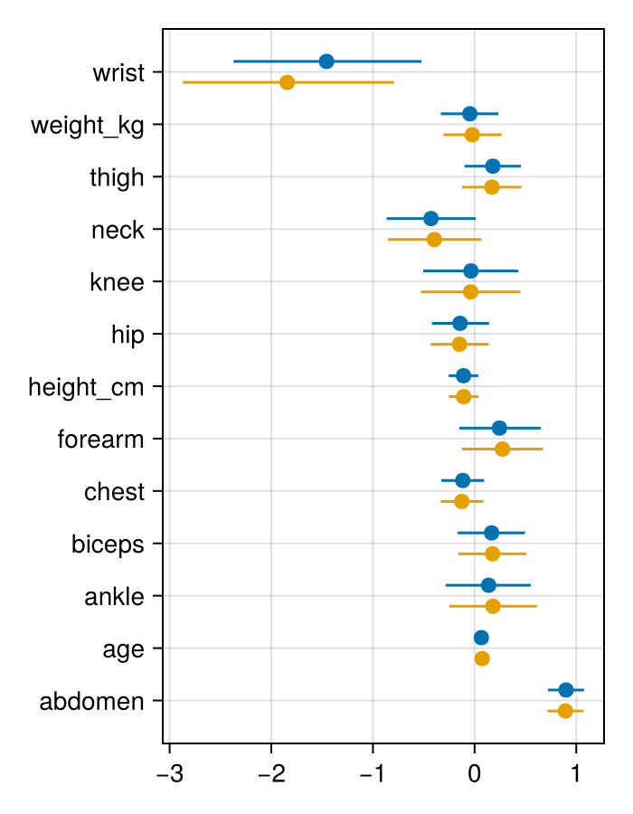
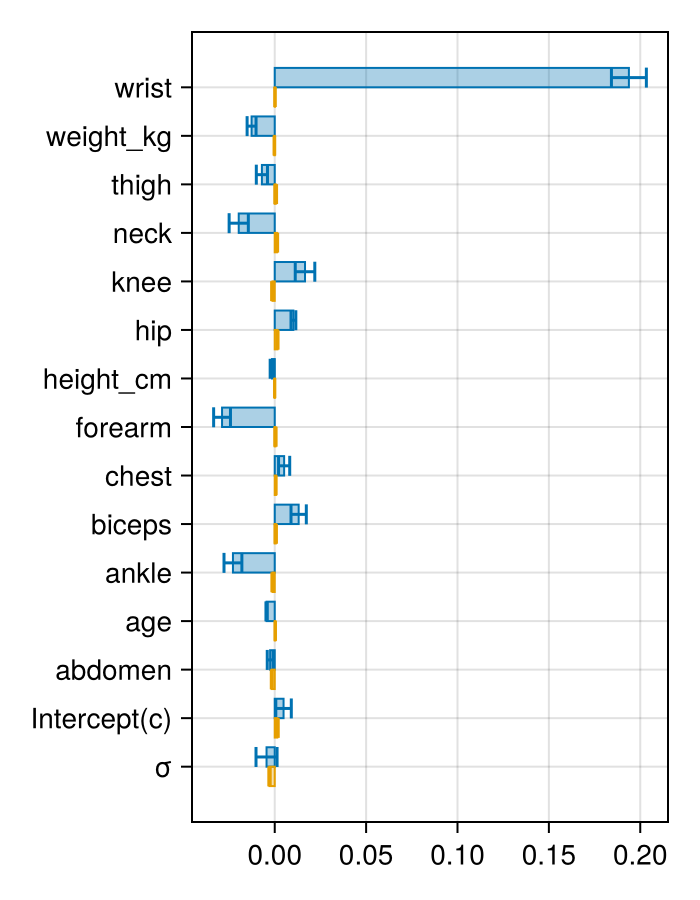

# Analyzing prior sensitivity

````julia
cd(dirname(@__DIR__))
push!(LOAD_PATH, @__DIR__)
push!(LOAD_PATH, joinpath(dirname(@__DIR__), "Analysis"))

using PriorSensitivityProblem
using DataFrames
using DelimitedFiles
using DifferentiableMH
using Distributions
using PDMats
using LinearAlgebra
using LogDensityProblems
using MCMCChains
using StochasticAD
using Statistics
using Turing
using ProgressMeter
using CairoMakie
import Random
import Analysis: take_samples, get_raw_chain_slim

Random.seed!(20240408);
Random.seed!(StochasticAD.RNG, 20240528);

# Monkey patch Bijectors for StochasticTriple
Bijectors._eps(::Type{StochasticTriple{T,V,FI}}) where {T,V,FI} = eps(V)

# Set up StochasticAD to use the stochastic derivatives in the paper
backend = StrategyWrapperFIsBackend(PrunedFIsBackend(Val(:wins)), StochasticAD.StraightThroughStrategy())  # aka uniformly pruning MVD
alg = StochasticAD.ForwardAlgorithm(backend)
;
````

## Introduction
The idea here is to do prior sensitivity analysis for a simple linear regression model, following

> Kallioinen, N., Paananen, T., Bürkner, P.-C. & Vehtari, A. Detecting and diagnosing prior and likelihood sensitivity with power-scaling. Stat Comput 34, 57 (2024).

The analysis scales the prior with an exponent $\alpha$.
Hence, $\alpha > 1$ upweighs the prior while $\alpha < 1$ downweighs it, and if the resulting posterior is
sensitive to the prior, then it should be sensitive to changes in $\alpha$.
Derivatives are taken with respect to $`\log_2 \alpha`$ (according to the paper recommendation) in order to have better
scaling properties of the sensitivity.

The paper uses a more sophisticated metric of sensitivity based on distances between base and perturbed posteriors,
and essentially differentiates that measurement wrt the ECDF of the posteriors.
The main trouble for us with that metric is that its derivative is discontinuous at the reference point; they average both sides in their formula.
Here we will as an illustration consider the derivative of the posterior mean, which is mentioned in the paper
and has been considered previously.

While the paper works out importance sampling estimators for this purpose, we can run it straight away with the DMH!

## Simple example
Consider first a small hierarchical model as a test case.
```math
\mu \sim \mathsf{N}(0,1), \qquad
\sigma \sim \mathsf{N}^+(2.0,2.5), \qquad
y_i \sim \mathsf{N}(\mu,\sigma^2)
```
We observe demo data according to a `priorsense` vignette.

````julia
# priors
@model function demo_model(y; m=0.0)
    μ ~ Normal(m,1)
    σ ~ truncated(Normal(2.0, 2.5); lower=0.0)
    N = length(y)
    for i in 1:N
        y[i] ~ Normal(μ, σ)
    end
end;

# Wrapper for handling Turing models
function make_targetlogpdf(model, args...; kwargs...)
    m = model(args...; kwargs...)
    vi = DynamicPPL.VarInfo(m)
    vi = DynamicPPL.link!!(vi, m)  # transforms to unconstrained space
    function model_logpdf(x, θ)
        vals = DynamicPPL.unflatten(vi, x)
        # FIXME: is there a better way than this really stupid hack to also
        # get the Jacobian term for transformed variables?
        loglik = DynamicPPL.loglikelihood(m, vals)
        logpri = DynamicPPL.logjoint(m, vals) - loglik
        loglik + 2^θ * logpri
    end
end;
untransform(p) = [p[1:end-1]..., exp(p[end])];
````

Example demo data from `priorsense`

````julia
obs = [9.5, 10.2, 9.1, 9.1, 10.3, 10.9, 11.7, 10.3, 9.6, 8.6, 9.1,
       11.1, 9.3, 10.5, 9.7, 10.3, 10.0, 9.8, 9.6, 8.3, 10.2, 9.8,
       10.0, 10.0, 9.1];
````

Set up model

````julia
# Start from prior means
init = [0.0, 1.071];

model_logpdf = make_targetlogpdf(demo_model,obs);
problem = make_prior_sensitivity_problem(model_logpdf, init, 200000; f = untransform, burn_in=0)
problem.targets["primal"].X(stochastic_triple(problem.settings.p; backend=alg.backend), problem.settings)

# FIXME take_samples does not support vector output :(
# samples = take_samples(problem, discrete_alg_flags = ["pruning"], store_samples = true)
````

````
2-element Vector{StochasticTriple{StochasticAD.Tag{typeof(identity), Float64}, Float64, StrategyWrapperFIs{Float64, PrunedFIs{Float64, StochasticAD.PrunedFIsModule.PrunedFIsState{Val{:wins}, Int64}}, StochasticAD.StraightThroughStrategy}}}:
 9.534393128101781 + -0.30058005873481886ε
 0.8867360239243471 + 0.1805051025905024ε
````

The derivatives tell us about the relative sensitivity of the parameters.
The paper vignette thinks $\mu$ is too sensitive, but we don't have a normalized metric here for ourselves...
Let's try to adjust the prior on $\mu$ to be closer to the data and see if it has less influence.

````julia
model_logpdf = make_targetlogpdf(demo_model,obs; m=mean(obs));
problem = make_prior_sensitivity_problem(model_logpdf, init, 200000; f = untransform, burn_in=0)
problem.targets["primal"].X(stochastic_triple(problem.settings.p; backend=alg.backend), problem.settings)
````

````
2-element Vector{StochasticTriple{StochasticAD.Tag{typeof(identity), Float64}, Float64, StrategyWrapperFIs{Float64, PrunedFIs{Float64, StochasticAD.PrunedFIsModule.PrunedFIsState{Val{:wins}, Int64}}, StochasticAD.StraightThroughStrategy}}}:
 9.849098884213356 + 2.7610393152798845e-5ε
 0.8180103377903132 + 0.0005170371181383768ε
````

The prior sensitivity was reduced by several orders of magnitude, and the prior is now less influential on the final estimate.

## Case study: Body fat data

Section 5.1 of the Kallioinen et al. paper considers a linear regression model for body fat percentage, with data from

> Johnson, R. W. Fitting Percentage of Body Fat to Simple Body Measurements. Journal of Statistics Education 4, 6 (1996).

and code at https://github.com/n-kall/powerscaling-sensitivity/tree/master/case-studies/bodyfat

The model is
```math
\begin{gathered}
y_i \sim \mathsf{N}(\mu_i, \sigma^2), \qquad \mu_i = \beta_0 + \sum_{k=1}^{13} \beta_k x_{ik} \\
\beta_0 \sim t_3(0.0,9.2), \qquad \beta_k \sim \mathsf{N}(0,1), \qquad \sigma \sim t_3^+(0,9.2)
\end{gathered}
```
The idea is that the prior for the regression coefficients $`\beta_k`$ are chosen to be "uninformative", although this inadvertently
fails as we will discover in the following analysis.

They use a subset of the observations and covariates, and we will attempt to recreate the case study as closely as possible.
Thus, following their Stan code, we will actually center the covariates and translate the intercept prior according to the response mean.
Even though we cannot (yet) interpret the scale of the sensitivity for the different parameters relative to each other,
we are still able to identify the absence of sensitivity as in the previous example.

Load the `bodyfat` data

````julia
basepath = dirname(@__DIR__)
raw_data, raw_header = DelimitedFiles.readdlm(joinpath(basepath, "prior_sensitivity/bodyfat.txt"), ';', header = true)
df = DataFrame(raw_data, vec(raw_header))
obs_names = ["wrist", "weight_kg", "thigh", "neck", "knee", "hip", "height_cm", "forearm", "chest", "biceps", "ankle", "age", "abdomen", "siri"]
obs = df[!, obs_names]
μ_obs = mean.(eachcol(obs))
σ_obs = std.(eachcol(obs));

# Prepare a centered data matrix (covariate estimate is unchanged!)
Xd = Matrix(obs[:,1:13]) .- μ_obs[1:13]';
````

Set up the model.

````julia
@model function bodyfat(
    X, y;
    prior_scales = 2.5 .* std(y) ./ vec(std(X; dims=1)),
    prior_β0_loc = mean(y)  # assumes centering
)
    βk ~ arraydist(Normal.(0,prior_scales))
    β0 ~ LocationScale(prior_β0_loc,9.2,TDist(3))
    σ ~ truncated(LocationScale(0.0,9.2,TDist(3)); lower=0.0)
    return y ~ MvNormal(β0 .+ X * βk, σ^2 * I)
end;
model_logpdf = make_targetlogpdf(bodyfat, Xd, obs[:,14]; prior_scales = ones(13));
````

Start from zero vector

````julia
init = zeros(15);
````

Set an attempt at a reasonable proposal distribution.
It uses the OLS variance with a step scaling and some knowledge from running NUTS of the σ posterior.

````julia
design_matrix = hcat(Xd, ones(nrow(obs)));
vc = cholesky(design_matrix' * design_matrix);
A = PDMat(0.02 .* cat(4.25.^2 .* inv(vc), 0.0375161^2; dims=(1,2)));
proposal = RandomWalkMHProposal{Vector{Float64}}(MvNormal(zero(init), A));
````

Run the DMH and display diagnostics for the primal.
It takes a long while to keep the whole history!

````julia
function raw_chains_to_summary(n_chains, get_raw, names)
    outputs = @showprogress map(1:n_chains) do _
        raw = get_raw()
        samples = @views reduce(hcat, map(state -> untransform(StochasticAD.value.(state)), raw.chain[(raw.settings.burn_in + 2):end]))'
        deltas = StochasticAD.delta.(raw.ret)
        return samples, deltas
    end
    samples = cat(first.(outputs)..., dims=3)
    deltas = hcat(last.(outputs)...)'
    Chains(samples, names), DataFrame(deltas, names)
end;
problem = make_prior_sensitivity_problem(model_logpdf, init, 350000; f = untransform, proposal, burn_in=100000)
out_primal, out_dual = raw_chains_to_summary(4,
    () -> get_raw_chain_slim(problem; target="primal", alg_id="pruning_uniform_mvd"),
    [obs_names[1:13]; "Intercept(c)"; "σ"]);
GC.gc();  # for people like me with puny computers

out_primal  # prints summary diagnostics
````

````
Chains MCMC chain (250000×15×4 Array{Float64, 3}):

Iterations        = 1:1:250000
Number of chains  = 4
Samples per chain = 250000
parameters        = wrist, weight_kg, thigh, neck, knee, hip, height_cm, forearm, chest, biceps, ankle, age, abdomen, Intercept(c), σ

Summary Statistics
    parameters      mean       std      mcse    ess_bulk     ess_tail      rhat   ess_per_sec
        Symbol   Float64   Float64   Float64     Float64      Float64   Float64       Missing

         wrist   -1.4564    0.4703    0.0064   5343.6045   10541.8707    1.0009       missing
     weight_kg   -0.0464    0.1439    0.0021   4576.4802    8982.8434    1.0009       missing
         thigh    0.1793    0.1416    0.0021   4696.6760    9143.6933    1.0016       missing
          neck   -0.4289    0.2233    0.0032   4849.5368    9926.4949    1.0005       missing
          knee   -0.0360    0.2392    0.0035   4722.4860    9414.3225    1.0006       missing
           hip   -0.1433    0.1422    0.0021   4546.8633    8396.7604    1.0006       missing
     height_cm   -0.1090    0.0741    0.0011   4537.0325    8945.3232    1.0007       missing
       forearm    0.2449    0.2044    0.0030   4553.6873    8669.6305    1.0003       missing
         chest   -0.1165    0.1075    0.0016   4518.7600    9170.3104    1.0009       missing
        biceps    0.1673    0.1694    0.0025   4528.9991    9041.2825    1.0025       missing
         ankle    0.1380    0.2134    0.0031   4738.4249    9589.3020    1.0005       missing
           age    0.0661    0.0311    0.0005   4628.3495    9001.8821    1.0010       missing
       abdomen    0.8997    0.0904    0.0013   4512.0577    8782.7984    1.0009       missing
  Intercept(c)   19.0866    0.2685    0.0040   4544.2035    9223.8700    1.0006       missing
             σ    4.2641    0.1962    0.0033   3587.8731    6449.6245    1.0011       missing

Quantiles
    parameters      2.5%     25.0%     50.0%     75.0%     97.5%
        Symbol   Float64   Float64   Float64   Float64   Float64

         wrist   -2.3716   -1.7744   -1.4582   -1.1424   -0.5220
     weight_kg   -0.3326   -0.1426   -0.0450    0.0506    0.2345
         thigh   -0.0986    0.0835    0.1798    0.2749    0.4566
          neck   -0.8651   -0.5801   -0.4285   -0.2787    0.0118
          knee   -0.5065   -0.1981   -0.0340    0.1266    0.4305
           hip   -0.4198   -0.2391   -0.1449   -0.0492    0.1418
     height_cm   -0.2547   -0.1588   -0.1089   -0.0591    0.0359
       forearm   -0.1503    0.1061    0.2435    0.3807    0.6515
         chest   -0.3287   -0.1888   -0.1158   -0.0438    0.0930
        biceps   -0.1658    0.0534    0.1690    0.2821    0.4961
         ankle   -0.2849   -0.0045    0.1403    0.2817    0.5530
           age    0.0047    0.0452    0.0663    0.0872    0.1267
       abdomen    0.7215    0.8394    0.9002    0.9604    1.0761
  Intercept(c)   18.5598   18.9052   19.0855   19.2676   19.6148
             σ    3.9052    4.1267    4.2562    4.3920    4.6687

````

One covariate stands out: `wrist`.
The results are less stable than one would like, so we could probably do with a better MCMC method,
but the results are the same as those detected by the quantitative metric in the Kallioinen et al. paper.
The values are hard to interpret since we have not accounted for scaling in the sensitivity estimates.

The conclusion in the paper is that the regression coefficient priors have the
wrong scale for the data and thus are unintentionally more informative than desired.
We now specify a model that accounts for the scale of the covariates relative to the response, by instead using
the priors $`\beta_k \sim \mathsf{N}(0, (2.5 s_y/s_{x_k})^2)`$.

````julia
model_logpdf2 = make_targetlogpdf(bodyfat, Xd, obs[:,14]; );
problem2 = make_prior_sensitivity_problem(model_logpdf2, init, 350000; f = untransform, proposal, burn_in=100000)
out_primal2, out_dual2 = raw_chains_to_summary(4,
    () -> get_raw_chain_slim(problem2; target="primal", alg_id="pruning_uniform_mvd"),
    [obs_names[1:13]; "Intercept(c)"; "σ"]);
GC.gc();

out_primal2
````

````
Chains MCMC chain (250000×15×4 Array{Float64, 3}):

Iterations        = 1:1:250000
Number of chains  = 4
Samples per chain = 250000
parameters        = wrist, weight_kg, thigh, neck, knee, hip, height_cm, forearm, chest, biceps, ankle, age, abdomen, Intercept(c), σ

Summary Statistics
    parameters      mean       std      mcse    ess_bulk    ess_tail      rhat   ess_per_sec
        Symbol   Float64   Float64   Float64     Float64     Float64   Float64       Missing

         wrist   -1.8435    0.5294    0.0078   4629.4759   8985.2577    1.0006       missing
     weight_kg   -0.0231    0.1462    0.0022   4484.8827   8801.7256    1.0013       missing
         thigh    0.1705    0.1484    0.0022   4515.7171   8549.5893    1.0005       missing
          neck   -0.3963    0.2353    0.0035   4542.6987   8543.5962    1.0008       missing
          knee   -0.0381    0.2486    0.0037   4416.4613   8780.6809    1.0016       missing
           hip   -0.1477    0.1458    0.0022   4474.7226   8606.1196    1.0018       missing
     height_cm   -0.1080    0.0743    0.0011   4507.6422   9222.4826    1.0014       missing
       forearm    0.2737    0.2046    0.0030   4584.0792   9088.0731    1.0008       missing
         chest   -0.1260    0.1066    0.0016   4637.5818   8506.7900    1.0016       missing
        biceps    0.1761    0.1689    0.0025   4568.4714   8535.7824    1.0009       missing
         ankle    0.1808    0.2195    0.0032   4564.6807   8946.8563    1.0014       missing
           age    0.0742    0.0321    0.0005   4513.4652   8306.0372    1.0004       missing
       abdomen    0.8933    0.0910    0.0014   4464.8705   8884.7800    1.0013       missing
  Intercept(c)   19.0843    0.2717    0.0041   4361.5025   8634.6863    1.0011       missing
             σ    4.2658    0.1979    0.0033   3524.5839   6163.1794    1.0036       missing

Quantiles
    parameters      2.5%     25.0%     50.0%     75.0%     97.5%
        Symbol   Float64   Float64   Float64   Float64   Float64

         wrist   -2.8703   -2.2037   -1.8456   -1.4895   -0.7936
     weight_kg   -0.3073   -0.1223   -0.0243    0.0756    0.2658
         thigh   -0.1229    0.0710    0.1720    0.2702    0.4598
          neck   -0.8563   -0.5554   -0.3962   -0.2383    0.0682
          knee   -0.5266   -0.2045   -0.0389    0.1275    0.4513
           hip   -0.4316   -0.2458   -0.1477   -0.0507    0.1397
     height_cm   -0.2537   -0.1584   -0.1081   -0.0574    0.0369
       forearm   -0.1268    0.1346    0.2741    0.4125    0.6737
         chest   -0.3339   -0.1978   -0.1263   -0.0546    0.0846
        biceps   -0.1598    0.0641    0.1767    0.2889    0.5070
         ankle   -0.2499    0.0330    0.1805    0.3268    0.6144
           age    0.0106    0.0528    0.0743    0.0957    0.1368
       abdomen    0.7156    0.8322    0.8930    0.9548    1.0714
  Intercept(c)   18.5528   18.9007   19.0834   19.2665   19.6222
             σ    3.8994    4.1292    4.2578    4.3921    4.6776

````

````julia
function primal_plot(before, after, subset; kwargs...)
    μ_before, μ_after = mean(before), mean(after)
    q_before, q_after = quantile(before; q=[0.025, 0.975]), quantile(after; q=[0.025, 0.975])
    ix = 1:length(subset)
    f = Figure(size=(350,450))
    ax = Axis(f[1,1]; yticks=(ix, string.(μ_before[subset,1])), yreversed=true, kwargs...)
    dodge = 0.2

    rangebars!(ax, ix .- dodge, q_before[subset,2], q_before[subset,3]; direction=:x)
    scatter!(ax, μ_before[subset,2], ix .- dodge; markersize=12)

    rangebars!(ax, ix .+ dodge, q_after[subset,2], q_after[subset,3]; direction=:x)
    scatter!(ax, μ_after[subset,2], ix .+ dodge; markersize=12)

    return f
end;
primal_plot(out_primal, out_primal2, 1:13)
````


````julia
function dual_plot(before, after; kwargs...)
    df_before, df_after = describe(before, :mean, :std), describe(after, :mean, :std)
    ix = 1:nrow(df_before)
    f = Figure(size=(350,450))
    ax = Axis(f[1,1]; yticks=(ix, string.(df_before.variable)), yreversed=true, kwargs...)
    dodge = 0.2
    color = Makie.wong_colors()

    barplot!(ax, ix .- dodge, df_before.mean; direction=:x, width=0.5, strokewidth=1, color=(color[1], 0.33), strokecolor=color[1])
    errorbars!(ax, df_before.mean, ix .- dodge, df_before.std ./ √(nrow(df_before)); direction=:x, whiskerwidth=10, color=color[1])

    barplot!(ax, ix .+ dodge, df_after.mean; direction=:x, width=0.5, strokewidth=1, color=(color[2], 0.33), strokecolor=color[2])
    errorbars!(ax, df_after.mean, ix .+ dodge, df_after.std ./ √(nrow(df_after)); direction=:x, whiskerwidth=10, color=color[2])

    return f
end;
dual_plot(out_dual, out_dual2)
````


We see that the prior sensitivity is now reduced, so that our goal of uninformative priors is closer to being achieved.
(Note that improper priors would have not been sensitive to power scaling.)

---

*This page was generated using [Literate.jl](https://github.com/fredrikekre/Literate.jl).*

