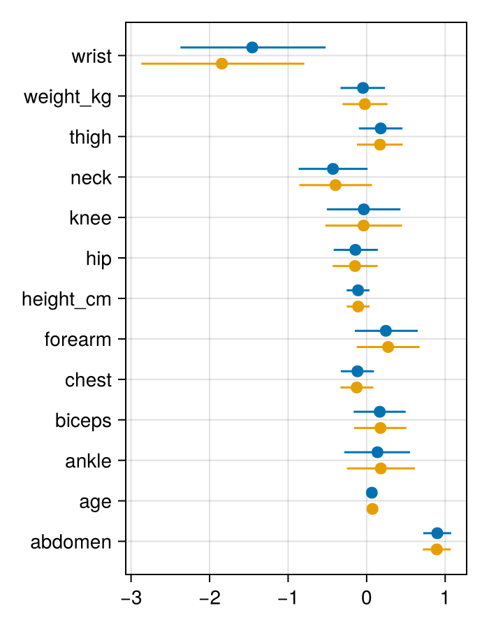
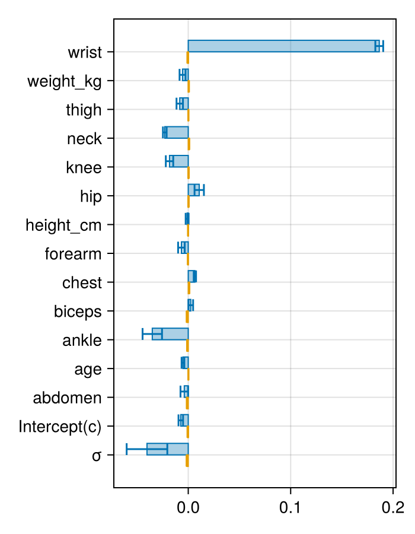

# Analyzing prior sensitivity

````julia

using PriorSensitivityProblem
using DataFrames
using DelimitedFiles
using DifferentiableMH
using Distributions
using PDMats
using LinearAlgebra
using LogDensityProblems
using MCMCChains
using StochasticAD
using Statistics
using Turing
using DynamicPPL
using ProgressMeter
using CairoMakie
import Bijectors
import Random
import Analysis: take_samples, get_primal_chain_slim, get_raw_chain_slim,
    get_primal_timing, get_derivative_timing

Random.seed!(20240408);
Random.seed!(StochasticAD.RNG, 20240528);

# Monkey patch Bijectors for StochasticTriple
Bijectors._eps(::Type{StochasticTriple{T,V,FI}}) where {T,V,FI} = eps(V)

# Support for a sinh link to transform the heavy-tailed intercept prior
struct SinhLink{Tloc,Tscale} <: Bijectors.Bijector
    loc::Tloc
    scale::Tscale
end

function Bijectors.with_logabsdet_jacobian(b::SinhLink, x)
    y = asinh.((x .- b.loc) ./ b.scale)
    return y, sum(-log(abs(b.scale)) .- log.(cosh.(y)))
end
Bijectors.transform(b::SinhLink, x) = first(Bijectors.with_logabsdet_jacobian(b, x))

function Bijectors.with_logabsdet_jacobian(ib::Bijectors.Inverse{<:SinhLink}, y)
    b = ib.orig
    x = b.loc .+ b.scale .* sinh.(y)
    return x, sum(log(abs(b.scale)) .+ log.(cosh.(y)))
end
Bijectors.transform(ib::Bijectors.Inverse{<:SinhLink}, y) = first(Bijectors.with_logabsdet_jacobian(ib, y))

struct LinkedDistribution{D<:ContinuousUnivariateDistribution,B<:Bijectors.Bijector} <: ContinuousUnivariateDistribution
    dist::D
    link::B
end

with_link(dist::ContinuousUnivariateDistribution, link::Bijectors.Bijector) = LinkedDistribution(dist, link)
function inverse_link_coordinate(p, idx, link)
    x = copy(p)
    x[idx] = Bijectors.inverse(link)(p[idx])
    return x
end;

Distributions.logpdf(d::LinkedDistribution, x::Real) = logpdf(d.dist, x)
Distributions.loglikelihood(d::LinkedDistribution, x) = loglikelihood(d.dist, x)
Distributions.params(d::LinkedDistribution) = params(d.dist)
Distributions.insupport(d::LinkedDistribution, x::Real) = insupport(d.dist, x)
Base.minimum(d::LinkedDistribution) = minimum(d.dist)
Base.maximum(d::LinkedDistribution) = maximum(d.dist)
Base.rand(rng::Random.AbstractRNG, d::LinkedDistribution) = rand(rng, d.dist)
Bijectors.bijector(d::LinkedDistribution) = d.link
DynamicPPL.link_transform(d::LinkedDistribution) = d.link

# Set up StochasticAD to use importance sampled pruning
backend = StrategyWrapperFIsBackend(PrunedFIsBackend(Val(:weights)), StochasticAD.StraightThroughStrategy())  # aka pruning MVD
alg = StochasticAD.ForwardAlgorithm(backend)
;
````

## Introduction
The idea here is to do prior sensitivity analysis for a simple linear regression model, following

> Kallioinen, N., Paananen, T., Bürkner, P.-C. & Vehtari, A. Detecting and diagnosing prior and likelihood sensitivity with power-scaling. Stat Comput 34, 57 (2024).

The analysis scales the prior with an exponent $\alpha$.
Hence, $\alpha > 1$ upweighs the prior while $\alpha < 1$ downweighs it, and if the resulting posterior is
sensitive to the prior, then it should be sensitive to changes in $\alpha$.
Derivatives are taken with respect to $`\log_2 \alpha`$ (according to the paper recommendation) in order to have better
scaling properties of the sensitivity.

The paper uses a more sophisticated metric of sensitivity based on distances between base and perturbed posteriors,
and essentially differentiates that measurement wrt the ECDF of the posteriors.
The main trouble for us with that metric is that its derivative is discontinuous at the reference point; they average both sides in their formula.
Here we will as an illustration consider the derivative of the posterior mean, which is mentioned in the paper
and has been considered previously.

While the paper works out importance sampling estimators for this purpose, we can run it straight away with the DMH!

## Simple example
Consider first a small hierarchical model as a test case.
```math
\mu \sim \mathsf{N}(0,1), \qquad
\sigma \sim \mathsf{N}^+(2.0,2.5), \qquad
y_i \sim \mathsf{N}(\mu,\sigma^2)
```
We observe demo data according to a `priorsense` vignette.

````julia
# priors
@model function demo_model(y; m=0.0)
    μ ~ Normal(m,1)
    σ ~ truncated(Normal(2.0, 2.5); lower=0.0)
    N = length(y)
    for i in 1:N
        y[i] ~ Normal(μ, σ)
    end
end;

# Wrapper for handling Turing models
function make_targetlogpdf(model, args...; kwargs...)
    m = model(args...; kwargs...)
    vi = DynamicPPL.VarInfo(m)
    vi = DynamicPPL.link!!(vi, m)  # transforms to unconstrained space
    function model_logpdf(x, θ)
        vals = DynamicPPL.unflatten(vi, x)
        # For linked VarInfo, `loglikelihood` carries the support-transform
        # corrections, while `logjoint - loglikelihood` leaves the model prior
        # on the original constrained parameterization for power scaling.
        loglik = DynamicPPL.loglikelihood(m, vals)
        logpri = DynamicPPL.logjoint(m, vals) - loglik
        loglik + 2^θ * logpri
    end
end;
untransform(p) = [p[1:end-1]..., exp(p[end])];
````

Example demo data from `priorsense`

````julia
obs = [9.5, 10.2, 9.1, 9.1, 10.3, 10.9, 11.7, 10.3, 9.6, 8.6, 9.1,
       11.1, 9.3, 10.5, 9.7, 10.3, 10.0, 9.8, 9.6, 8.3, 10.2, 9.8,
       10.0, 10.0, 9.1];
````

Set up model

````julia
# Start from prior means
init = [0.0, 1.071];

model_logpdf = make_targetlogpdf(demo_model,obs);
problem = make_prior_sensitivity_problem(model_logpdf, init, 200000; f = untransform, burn_in=0)
problem.targets["primal"].X(stochastic_triple(problem.settings.p; backend=alg.backend), problem.settings)

# FIXME take_samples does not support vector output :(
# samples = take_samples(problem, discrete_alg_flags = ["pruning"], store_samples = true)
````

````
2-element Vector{StochasticAD.StochasticTriple{StochasticAD.Tag{typeof(identity), Float64}, Float64, StochasticAD.StrategyWrapperFIsModule.StrategyWrapperFIs{Float64, StochasticAD.PrunedFIsModule.PrunedFIs{Float64, StochasticAD.PrunedFIsModule.PrunedFIsState{Val{:weights}, Nothing}}, StochasticAD.StraightThroughStrategy}}}:
 9.534393128101781 + -0.29026712035004115ε
 0.8867360239243471 + 0.14166129396339444ε
````

The derivatives tell us about the relative sensitivity of the parameters.
The paper vignette thinks $\mu$ is too sensitive, but we don't have a normalized metric here for ourselves...
Let's try to adjust the prior on $\mu$ to be closer to the data and see if it has less influence.

````julia
model_logpdf = make_targetlogpdf(demo_model,obs; m=mean(obs));
problem = make_prior_sensitivity_problem(model_logpdf, init, 200000; f = untransform, burn_in=0)
problem.targets["primal"].X(stochastic_triple(problem.settings.p; backend=alg.backend), problem.settings)
````

````
2-element Vector{StochasticAD.StochasticTriple{StochasticAD.Tag{typeof(identity), Float64}, Float64, StochasticAD.StrategyWrapperFIsModule.StrategyWrapperFIs{Float64, StochasticAD.PrunedFIsModule.PrunedFIs{Float64, StochasticAD.PrunedFIsModule.PrunedFIsState{Val{:weights}, Nothing}}, StochasticAD.StraightThroughStrategy}}}:
 9.849098884213356 + 0.0005278747466101784ε
 0.8180103377903132 + 0.0008655666178187703ε
````

The prior sensitivity was reduced by several orders of magnitude, and the prior is now less influential on the final estimate.

## Case study: Body fat data

Section 5.1 of the Kallioinen et al. paper considers a linear regression model for body fat percentage, with data from

> Johnson, R. W. Fitting Percentage of Body Fat to Simple Body Measurements. Journal of Statistics Education 4, 6 (1996).

and code at https://github.com/n-kall/powerscaling-sensitivity/tree/master/case-studies/bodyfat

The model is
```math
\begin{gathered}
y_i \sim \mathsf{N}(\mu_i, \sigma^2), \qquad \mu_i = \beta_0 + \sum_{k=1}^{13} \beta_k x_{ik} \\
\beta_0 \sim t_3(0.0,9.2), \qquad \beta_k \sim \mathsf{N}(0,1), \qquad \sigma \sim t_3^+(0,9.2)
\end{gathered}
```
The idea is that the prior for the regression coefficients $`\beta_k`$ are chosen to be "uninformative", although this inadvertently
fails as we will discover in the following analysis.

They use a subset of the observations and covariates, and we will attempt to recreate the case study as closely as possible.
Thus, following their Stan code, we will actually center the covariates and translate the intercept prior according to the response mean.
Even though we cannot (yet) interpret the scale of the sensitivity for the different parameters relative to each other,
we are still able to identify the absence of sensitivity as in the previous example.

Load the `bodyfat` data

````julia
basepath = dirname("/cephyr/users/rubense/Vera/repos/differentiable_mh/experiments/prior_sensitivity")
raw_data, raw_header = DelimitedFiles.readdlm(joinpath(basepath, "prior_sensitivity/bodyfat.txt"), ';', header = true)
df = DataFrame(raw_data, vec(raw_header))
obs_names = ["wrist", "weight_kg", "thigh", "neck", "knee", "hip", "height_cm", "forearm", "chest", "biceps", "ankle", "age", "abdomen", "siri"]
obs = df[!, obs_names]
μ_obs = mean.(eachcol(obs))
σ_obs = std.(eachcol(obs));

# Prepare a centered data matrix (covariate estimate is unchanged!)
Xd = Matrix(obs[:,1:13]) .- μ_obs[1:13]';
````

Set up the model.

````julia
@model function bodyfat(
    X, y;
    prior_scales = 2.5 .* std(y) ./ vec(std(X; dims=1)),
    prior_β0_loc = mean(y)  # assumes centering
)
    βk ~ arraydist(Normal.(0,prior_scales))
    β0 ~ with_link(
        LocationScale(prior_β0_loc,9.2,TDist(3)),
        SinhLink(prior_β0_loc, 1.0),
    )
    σ ~ truncated(LocationScale(0.0,9.2,TDist(3)); lower=0.0)
    return y ~ MvNormal(β0 .+ X * βk, σ^2 * I)
end;
model_logpdf = make_targetlogpdf(bodyfat, Xd, obs[:,14]; prior_scales = ones(13));
bodyfat_untransform(p) = untransform(inverse_link_coordinate(p, 14, SinhLink(mean(obs[:,14]), 1.0)));
````

Start from zero slopes, the intercept prior location, and unit residual scale.

````julia
init = zeros(15);
````

Set an attempt at a reasonable proposal distribution.
It uses the OLS variance with a step scaling and some knowledge from running NUTS of the σ posterior.

````julia
design_matrix = hcat(Xd, ones(nrow(obs)));
vc = cholesky(design_matrix' * design_matrix);
A = PDMat(0.02 .* cat(4.25.^2 .* inv(vc), 0.0375161^2; dims=(1,2)));
proposal = RandomWalkMHProposal{Vector{Float64}}(MvNormal(zero(init), A));
````

Run the DMH and display diagnostics for the primal.
It takes a long while to keep the whole history!

````julia
function raw_chains_to_summary(n_chains, get_raw, names; untransform=untransform)
    outputs = @showprogress map(1:n_chains) do _
        raw = get_raw()
        samples = @views reduce(hcat, map(state -> untransform(StochasticAD.value.(state)), raw.chain[(raw.settings.burn_in + 2):end]))'
        deltas = StochasticAD.delta.(raw.ret)
        return samples, deltas, raw.duration
    end
    samples = cat(first.(outputs)..., dims=3)
    deltas = hcat(map(output -> output[2], outputs)...)'
    durations = map(output -> output[3], outputs)
    Chains(samples, names; info = (; duration = sum(durations), durations)), DataFrame(deltas, names)
end;
problem = make_prior_sensitivity_problem(model_logpdf, init, 500_000; f = bodyfat_untransform, proposal, burn_in=100_000)
out_primal, out_dual = raw_chains_to_summary(4,
    () -> get_raw_chain_slim(problem; target="primal", alg_id="pruning_mvd"),
    [obs_names[1:13]; "Intercept(c)"; "σ"];
    untransform=bodyfat_untransform);
GC.gc();  # for people like me with puny computers

describe(out_primal)  # prints summary diagnostics
````

````

Progress:  50%|████████████████████▌                    |  ETA: 0:04:03
Progress: 100%|█████████████████████████████████████████| Time: 0:07:58
Chains MCMC chain (400000×15×4 Array{Float64, 3}):

Iterations        = 1:1:400000
Number of chains  = 4
Samples per chain = 400000
parameters        = wrist, weight_kg, thigh, neck, knee, hip, height_cm, forearm, chest, biceps, ankle, age, abdomen, Intercept(c), σ

Summary Statistics
    parameters      mean       std      mcse    ess_bulk     ess_tail      rhat   ess_per_sec
        Symbol   Float64   Float64   Float64     Float64      Float64   Float64       Missing

         wrist   -1.4494    0.4666    0.0050   8587.1461   16682.6486    1.0007       missing
     weight_kg   -0.0423    0.1447    0.0017   7334.9388   13742.4786    1.0004       missing
         thigh    0.1774    0.1445    0.0017   7186.7421   14068.3608    1.0026       missing
          neck   -0.4261    0.2265    0.0026   7458.4225   15579.3618    1.0006       missing
          knee   -0.0450    0.2385    0.0027   7549.5133   14775.6449    1.0004       missing
           hip   -0.1421    0.1426    0.0017   7229.8578   14590.4263    1.0009       missing
     height_cm   -0.1095    0.0740    0.0009   7256.8254   14373.3050    1.0003       missing
       forearm    0.2423    0.2020    0.0024   7275.7058   14836.7740    1.0004       missing
         chest   -0.1202    0.1083    0.0013   7221.5255   14057.7780    1.0012       missing
        biceps    0.1657    0.1671    0.0020   7308.3497   14378.3040    1.0005       missing
         ankle    0.1327    0.2135    0.0024   7608.1600   15043.6901    1.0006       missing
           age    0.0665    0.0318    0.0004   7214.8598   14057.5100    1.0005       missing
       abdomen    0.8990    0.0913    0.0011   7028.4371   14169.3409    1.0011       missing
  Intercept(c)   19.0881    0.2713    0.0032   7254.2582   15647.2933    1.0003       missing
             σ    4.2633    0.1951    0.0026   5709.5468   10978.9581    1.0011       missing

Quantiles
    parameters      2.5%     25.0%     50.0%     75.0%     97.5%
        Symbol   Float64   Float64   Float64   Float64   Float64

         wrist   -2.3693   -1.7632   -1.4479   -1.1347   -0.5333
     weight_kg   -0.3239   -0.1398   -0.0437    0.0548    0.2445
         thigh   -0.1068    0.0804    0.1775    0.2739    0.4632
          neck   -0.8698   -0.5787   -0.4257   -0.2733    0.0183
          knee   -0.5107   -0.2061   -0.0458    0.1144    0.4271
           hip   -0.4209   -0.2385   -0.1418   -0.0455    0.1368
     height_cm   -0.2549   -0.1596   -0.1094   -0.0595    0.0350
       forearm   -0.1523    0.1056    0.2421    0.3796    0.6365
         chest   -0.3338   -0.1927   -0.1200   -0.0472    0.0913
        biceps   -0.1623    0.0538    0.1655    0.2765    0.4960
         ankle   -0.2885   -0.0102    0.1347    0.2748    0.5516
           age    0.0041    0.0451    0.0665    0.0880    0.1285
       abdomen    0.7195    0.8374    0.8993    0.9611    1.0752
  Intercept(c)   18.5577   18.9054   19.0875   19.2703   19.6233
             σ    3.9002    4.1279    4.2568    4.3913    4.6624

````

One covariate stands out: `wrist`.
The results are less stable than one would like, so we could probably do with a better MCMC method,
but the results are the same as those detected by the quantitative metric in the Kallioinen et al. paper.
The values are hard to interpret since we have not accounted for scaling in the sensitivity estimates.

The conclusion in the paper is that the regression coefficient priors have the
wrong scale for the data and thus are unintentionally more informative than desired.
We now specify a model that accounts for the scale of the covariates relative to the response, by instead using
the priors $`\beta_k \sim \mathsf{N}(0, (2.5 s_y/s_{x_k})^2)`$.

````julia
model_logpdf2 = make_targetlogpdf(bodyfat, Xd, obs[:,14]; );
problem2 = make_prior_sensitivity_problem(model_logpdf2, init, 500_000; f = bodyfat_untransform, proposal, burn_in=100_000)
out_primal2, out_dual2 = raw_chains_to_summary(4,
    () -> get_raw_chain_slim(problem2; target="primal", alg_id="pruning_mvd"),
    [obs_names[1:13]; "Intercept(c)"; "σ"];
    untransform=bodyfat_untransform);
GC.gc();

describe(out_primal2)
````

````

Progress:  50%|████████████████████▌                    |  ETA: 0:03:54
Progress: 100%|█████████████████████████████████████████| Time: 0:07:47
Chains MCMC chain (400000×15×4 Array{Float64, 3}):

Iterations        = 1:1:400000
Number of chains  = 4
Samples per chain = 400000
parameters        = wrist, weight_kg, thigh, neck, knee, hip, height_cm, forearm, chest, biceps, ankle, age, abdomen, Intercept(c), σ

Summary Statistics
    parameters      mean       std      mcse    ess_bulk     ess_tail      rhat   ess_per_sec
        Symbol   Float64   Float64   Float64     Float64      Float64   Float64       Missing

         wrist   -1.8489    0.5359    0.0064   7091.4865   13961.6857    1.0004       missing
     weight_kg   -0.0264    0.1492    0.0018   7055.4932   13810.1525    1.0014       missing
         thigh    0.1700    0.1464    0.0017   7234.0116   14219.7701    1.0005       missing
          neck   -0.3956    0.2369    0.0028   7100.4938   14156.7660    1.0006       missing
          knee   -0.0428    0.2443    0.0029   7221.9044   13967.9111    1.0005       missing
           hip   -0.1446    0.1443    0.0017   7153.4256   13973.2305    1.0006       missing
     height_cm   -0.1075    0.0753    0.0009   7137.0731   13925.5319    1.0011       missing
       forearm    0.2774    0.2096    0.0025   7172.2972   14185.9207    1.0014       missing
         chest   -0.1267    0.1089    0.0013   7200.9526   14405.7582    1.0007       missing
        biceps    0.1787    0.1718    0.0020   7208.3426   14609.5576    1.0014       missing
         ankle    0.1764    0.2181    0.0025   7395.4540   14592.4867    1.0003       missing
           age    0.0742    0.0320    0.0004   7353.6368   14855.9323    1.0012       missing
       abdomen    0.8955    0.0912    0.0011   7193.3439   14657.9708    1.0005       missing
  Intercept(c)   19.0848    0.2682    0.0031   7584.6096   16446.5050    1.0003       missing
             σ    4.2685    0.1944    0.0026   5769.0242   10874.9316    1.0004       missing

Quantiles
    parameters      2.5%     25.0%     50.0%     75.0%     97.5%
        Symbol   Float64   Float64   Float64   Float64   Float64

         wrist   -2.9041   -2.2092   -1.8468   -1.4856   -0.7993
     weight_kg   -0.3166   -0.1277   -0.0275    0.0749    0.2667
         thigh   -0.1188    0.0721    0.1699    0.2684    0.4580
          neck   -0.8624   -0.5560   -0.3930   -0.2349    0.0654
          knee   -0.5232   -0.2058   -0.0424    0.1197    0.4366
           hip   -0.4273   -0.2414   -0.1452   -0.0478    0.1402
     height_cm   -0.2541   -0.1585   -0.1075   -0.0564    0.0398
       forearm   -0.1326    0.1360    0.2767    0.4178    0.6893
         chest   -0.3379   -0.2006   -0.1271   -0.0537    0.0883
        biceps   -0.1581    0.0633    0.1785    0.2943    0.5168
         ankle   -0.2550    0.0309    0.1769    0.3236    0.6024
           age    0.0114    0.0526    0.0744    0.0958    0.1365
       abdomen    0.7167    0.8342    0.8952    0.9570    1.0740
  Intercept(c)   18.5609   18.9040   19.0837   19.2651   19.6152
             σ    3.9108    4.1330    4.2608    4.3965    4.6669

````

````julia
function primal_plot(l, before, after, subset; kwargs...)
    μ_before, μ_after = mean(before), mean(after)
    q_before, q_after = quantile(before; q=[0.025, 0.975]), quantile(after; q=[0.025, 0.975])
    ix = 1:length(subset)
    ax = Axis(l; yticks=(ix, string.(μ_before[subset,1])), yreversed=true, kwargs...)
    dodge = 0.2

    rangebars!(ax, ix .- dodge, q_before[subset,2], q_before[subset,3]; direction=:x)
    scatter!(ax, μ_before[subset,2], ix .- dodge; markersize=12)

    rangebars!(ax, ix .+ dodge, q_after[subset,2], q_after[subset,3]; direction=:x)
    scatter!(ax, μ_after[subset,2], ix .+ dodge; markersize=12)
end;
f = Figure(size=(350,450))
primal_plot(f[1,1], out_primal, out_primal2, 1:13)
f
````


````julia
function dual_plot(l, before, after; kwargs...)
    df_before, df_after = describe(before, :mean, :std), describe(after, :mean, :std)
    ix = 1:nrow(df_before)
    ax = Axis(l; yticks=(ix, string.(df_before.variable)), yreversed=true, kwargs...)
    dodge = 0.2
    color = Makie.wong_colors()

    barplot!(ax, ix .- dodge, df_before.mean; direction=:x, width=0.5, strokewidth=1, color=(color[1], 0.33), strokecolor=color[1])
    errorbars!(ax, df_before.mean, ix .- dodge, df_before.std ./ √(nrow(before)); direction=:x, whiskerwidth=10, color=color[1])

    barplot!(ax, ix .+ dodge, df_after.mean; direction=:x, width=0.5, strokewidth=1, color=(color[2], 0.33), strokecolor=color[2])
    errorbars!(ax, df_after.mean, ix .+ dodge, df_after.std ./ √(nrow(after)); direction=:x, whiskerwidth=10, color=color[2])
end;
f = Figure(size=(350,450))
dual_plot(f[1,1], out_dual, out_dual2)
f
````


We see that the prior sensitivity is now reduced, so that our goal of uninformative priors is closer to being achieved.
(Note that improper priors would have not been sensitive to power scaling.)

````julia
# Publication plot
f = Figure(size=(800,450))
primal_plot(f[1,1], out_primal, out_primal2, 1:13)
dual_plot(f[1,2], out_dual, out_dual2)
Label(f[1,1,TopLeft()], "A", font=:bold, halign = :left)
Label(f[1,2,TopLeft()], "B", font=:bold, halign = :left)
save("../assets/prior_sensitivity.pdf", f);

# Timings
primal_timing = get_primal_timing(problem; target="primal")
derivative_timing = get_derivative_timing(
    problem; target="primal", backend=backend)

(;
    primal_ns = primal_timing.ns,
    derivative_ns = derivative_timing.ns,
    ratio = derivative_timing.ns / primal_timing.ns,
)
````

````
(primal_ns = 13915.342818, derivative_ns = 226732.531002, ratio = 16.29370788542222)
````

---

*This page was generated using [Literate.jl](https://github.com/fredrikekre/Literate.jl).*

